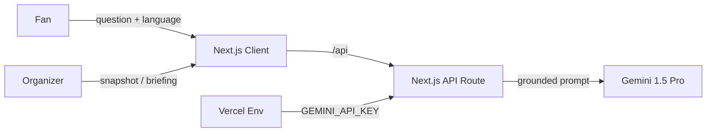

# StadiumSync — Smart Stadiums & Tournament Operations

[](https://github.com/Ndheeraj906/stadium-operations-copilot/actions/workflows/ci.yml)
[](https://github.com/Ndheeraj906/stadium-operations-copilot/actions/workflows/codeql.yml)
[](LICENSE)
[](#testing)

GenAI platform for the **FIFA World Cup 2026** that enhances both the fan experience and venue operations at Estadio Azteca. Fans get multilingual, grounded navigation, accessibility and transport help; organizers get live crowd intelligence and AI-generated operational briefings for real-time decisions.

**Live demo:** <https://stadium-sync-google-cloud-run-three.vercel.app/>
**Repository:** <https://github.com/Ndheeraj906/stadium-operations-copilot>

---

## Chosen Vertical

**Smart Stadiums & Tournament Operations** (FIFA World Cup 2026), serving two personas with one platform:

- **Fans** — a multilingual matchday assistant for navigation, accessibility, transport and venue questions (`/assistant`).
- **Organizers / venue staff** — an operations command center with live crowd density, incidents, sustainability metrics and AI decision support (`/operations`).

---

## Problem Statement Alignment

> Build a GenAI-enabled solution that enhances stadium operations and the overall tournament experience for fans, organizers, volunteers, or venue staff during the FIFA World Cup 2026 — navigation, crowd management, accessibility, transportation, sustainability, multilingual assistance, operational intelligence, or real-time decision support.

Every requirement below is a working, demonstrable flow on the live URL. Nothing ships that is not a row in this table.

| #   | Requirement (problem-statement theme) | How StadiumSync delivers it                                                                                          | Live route               |
| --- | ------------------------------------- | ------------------------------------------------------------------------------------------------------------------ | ------------------------ |
| R1  | **Navigation**                        | Assistant gives grounded wayfinding — which gate serves a section, step-free routes to any facility                | `/assistant`             |
| R2  | **Crowd management**                  | Operations board shows per-zone density with comfortable/busy/critical status; AI briefing recommends redirections | `/operations`            |
| R3  | **Accessibility**                     | Accessible-route answers (Gate 6, elevators, sensory room) plus a WCAG 2.1 AA interface throughout                 | `/assistant` + whole app |
| R4  | **Transportation**                    | Assistant answers on metro, fan shuttle, bus, parking and rideshare, including accessible options                  | `/assistant`             |
| R5  | **Sustainability**                    | Live sustainability meters (waste diverted, energy, water refills, CO₂ saved) and AI sustainability actions        | `/operations`            |
| R6  | **Multilingual assistance**           | Assistant answers in English, Spanish, French, Portuguese and Arabic                                               | `/assistant`             |
| R7  | **Operational intelligence**          | Live operational snapshot (zones, incidents, sustainability) from simulated live data, auto-refreshing               | `/operations`            |
| R8  | **Real-time decision support**        | "Generate AI Briefing" turns the current live snapshot into prioritized crowd, incident and sustainability actions | `/operations`            |

---

## Features

- **Matchday Fan Assistant** (`/assistant`) — a multilingual chat grounded on the official venue dataset. Quick-action chips for the most common questions, a language selector, and answers that prioritize step-free and accessible options when mobility is mentioned.
- **Operations Command Center** (`/operations`) — a live board of zone crowd density, open incidents and sustainability metrics, refreshed on an interval, with an on-demand **AI Operations Briefing** that reads the current snapshot and returns prioritized recommendations.

---

## Architecture

This project is built using **Next.js 14 App Router**. Route handlers act as the backend API dispatch; UI components are rendered on the client for extreme efficiency.



### API

| Method + path                           | Purpose                                |
| --------------------------------------- | -------------------------------------- |
| `POST /api/assistant`                   | Grounded, multilingual answer (Gemini) |
| `GET /api/operations`                   | Live zones, incidents, sustainability  |
| `POST /api/operations`                  | AI operations briefing (Gemini)        |

---

## Tech Stack

Next.js 14 · React 18 · TypeScript 5 (strict) · Tailwind CSS · Zod · `@google/genai` (Gemini 1.5 Pro) · Vitest · Testing Library.

Contributors: see [CONTRIBUTING.md](CONTRIBUTING.md).

---

## Getting Started

```bash
# 1. Install dependencies
npm install

# 2. Set environment variables
cp .env.example .env
# Edit .env and add your GEMINI_API_KEY

# 3. Start development server
npm run dev
```

Visit `http://localhost:3000` to view the app.
